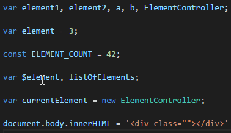

# Multiple cursor case preserve

## Features
Have you ever tried to change a single word in all variable names, but had your camelCase broken? This extension preserves selection case in these situations. It recognises CAPS, Uppercase and lowercase. Works for typing or copy-pasting.

## Known Issues

 - Be careful, if you undo and redo this after making any further changes - VSCode will lose any forward history, you won't be able to redo anything, that was done after. Better undo the change manually.
 - Probably won't properly work for multiline selections, but this scenario doesn't seem likely.

## Release Notes

### 1.0.0

Initial release
